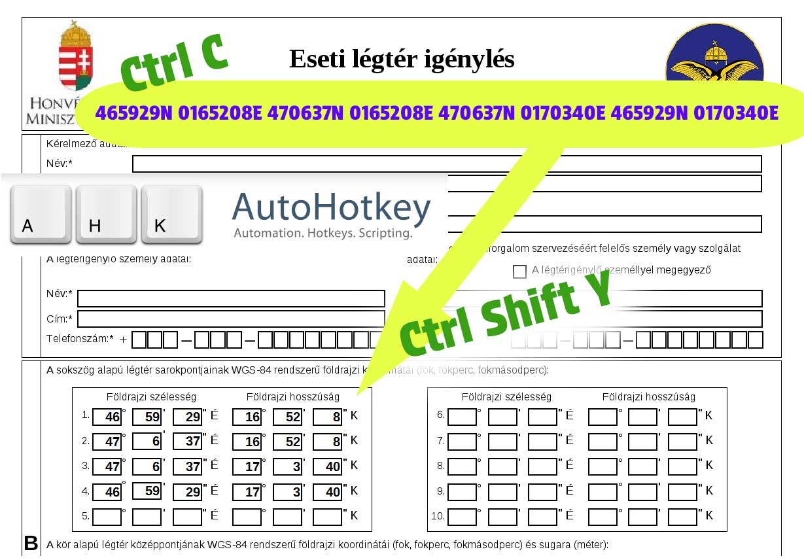

# Figyelem!
A kód működéséért felelősséget nem vállalok! Mindenki saját felelősségére használja!

# Miért?
Mert nem akarjuk egyesével bepötyögni a GPS koordinátákat!

# Hogyan?
1. AutoHotkey telepítése https://www.autohotkey.com/
2. "ahk_eseti_legter_anyk.ahk" letöltése innen.
3. "ahk_eseti_legter_anyk.ahk" dupla kattintással indul
4. GPS koordináták egy sorba rendezése, ilyen módon: 465929N 0165208E 470637N 0165208E 470637N 0170340E 465929N 0170340E
5. Kijelölés, Másolás (Jobb egér, Másolás vagy Ctrl C)
6. Az "Eseti légtér igénylés" nyomtatványon lévő kooridinátákat tartalmazó első mezőjébe lépve: Ctrl Shift Y
7. A szkript automatikusan beilleszti a megfelelő helyekre, a tabulátorokkal mezőt váltva a szükséges értékeket.
8. Ellenőrizd le, hogy tényleg jó értékek kerültek be!

# Mezők törlése
Ha a koordináta mezőket törölni szeretnéd:

Del Tab Del Tab Del Tab Del Tab Del Tab ...
1. Kattints az első koordináta mezőbe
2. Delete gomb megnyomása
3. Tabultáor gomb megnyomása
4. Ismétlés, amíg az összes mező üres nem lesz!

Ezt is lehetne automatizálni?

Lehetne. :D